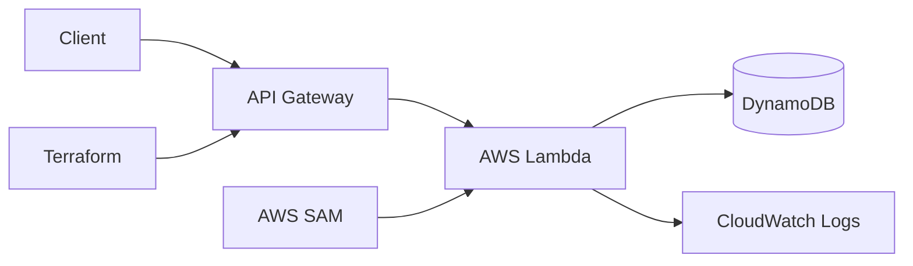

# Serverless REST API with Lambda, API Gateway, DynamoDB, SAM and Terraform

> **Stage 4 of 12 — Career Progression Project**  
> Portfolio project by **Yugandhar Ethamukkala**.

Serverless API project that provisions AWS Lambda, API Gateway, DynamoDB, and related infrastructure using Terraform and SAM templates.

## Career Progression Story

Serverless step: I expanded from containers into event-driven AWS serverless architecture.

This repo is part of my 12-project DevOps portfolio path. The goal is to show steady growth from CI/CD foundations into AWS cloud, Kubernetes, GitOps, observability, DevSecOps, progressive delivery, and AI-enabled deployments.

## What This Project Demonstrates

- Adds serverless coverage to the portfolio beyond containers and Kubernetes.
- Good for discussing IAM least privilege, Lambda execution roles, API Gateway, and DynamoDB design.
- Useful low-maintenance AWS project with clear cleanup controls.

## Tech Stack

`Node.js` `AWS Lambda` `API Gateway` `DynamoDB` `Terraform` `AWS SAM` `IAM` `CloudWatch`

## Architecture



## Repository Structure

```text
.
├── LICENSE
├── README.md
├── REPO_UPLOAD_CHECKLIST.md
├── docs/
├── package-lock.json
├── package.json
├── project.yaml
├── sam/
├── scripts/
├── terraform/
```

## Prerequisites

- Git
- Docker where containers are used
- Cloud CLI/tools only when deploying cloud resources
- `kubectl`, `kind`, `terraform`, `sam`, `maven`, `npm`, or `python` depending on the project
- Never commit real `.env` files, API keys, access keys, kubeconfigs, private keys, or tokens

## Local Run

```bash
npm install
cd scripts && npm install
node scripts/import-products.js --dry-run
```

## Validation Before GitHub Upload

Run these checks before pushing major changes:

```bash
terraform -chdir=terraform fmt -check
terraform -chdir=terraform validate
sam validate --template-file sam/template.yaml
```

## Deployment Overview

1. Deploy shared infrastructure with Terraform.
2. Package/deploy Lambda functions with SAM.
3. Test API Gateway endpoints using curl or Postman.
4. Review CloudWatch logs for Lambda execution errors.

## Screenshots to Add

This project did not include ready project snapshots in the uploaded folder, so I prepared a screenshot folder for you.

Add these after you run the project:

- `docs/screenshots/architecture.png`
- `docs/screenshots/pipeline-success.png`
- `docs/screenshots/deployment-output.png`
- `docs/screenshots/monitoring-dashboard.png`
- `docs/screenshots/cleanup-proof.png`

Do not add screenshots with account IDs, IP addresses, tokens, billing pages, or private URLs.

## Cleanup / Cost Control

Run cleanup commands after testing so cloud resources do not keep charging:

```bash
terraform -chdir=terraform destroy -auto-approve
aws cloudformation delete-stack --stack-name serverless-api-dynamodb || true
```

## Security Notes

- Use GitHub Actions OIDC, Jenkins credentials, AWS Secrets Manager, Vault, or Kubernetes Secrets instead of hard-coded keys.
- Keep `.env` files local and commit only `.env.example` with safe placeholders.
- Review Terraform plans before apply/destroy.
- Do not publish account IDs, private IPs, public IPs from your lab, billing pages, or credential screenshots.

## How I Would Explain This in an Interview

I built this project as part of my DevOps portfolio to show hands-on experience with the tools used in real delivery environments. The focus is not only on writing code, but also on creating a repeatable workflow for build, validation, deployment, security, monitoring, and cleanup.

In a real project, I would connect this type of setup with environment-specific variables, approval gates, secrets management, monitoring dashboards, and rollback steps so teams can release safely and troubleshoot faster.

---

<p align="center">
  
</p>

<h2 align="center">🤝 Connect With Me</h2>

<p align="center">
  <em>
    Thanks for visiting this project! I’m continuously building hands-on DevOps, Cloud, Automation, and AI-enabled engineering projects to improve real-world deployment, monitoring, and infrastructure skills.
  </em>
</p>

<p align="center">
  
</p>

<p align="center">
  <a href="https://github.com/yugandhar99" target="_blank" rel="noopener noreferrer">
    
  </a>
  <a href="https://www.linkedin.com/in/yugandhar-devops" target="_blank" rel="noopener noreferrer">
    
  </a>
  <a href="https://yugandhar-portfolio-psi.vercel.app/" target="_blank" rel="noopener noreferrer">
    
  </a>
  <a href="mailto:yugandharethamukkala1999@gmail.com">
    
  </a>
</p>

<p align="center">
  
  
  
  
</p>

---

<p align="center">
  ⭐ If this project added value, feel free to star the repository and connect with me!
</p>

<p align="center">
  <strong>Built with ❤️ using modern DevOps practices</strong>
</p>

